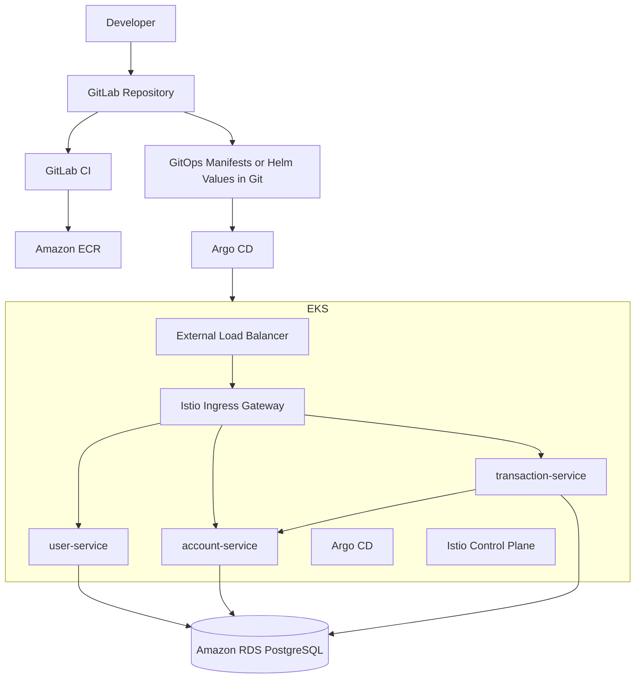
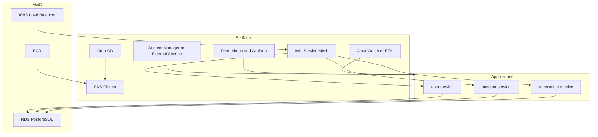
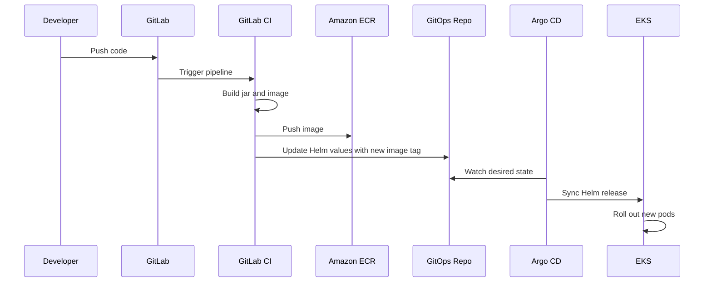
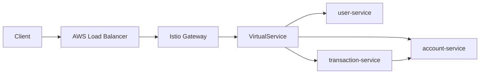
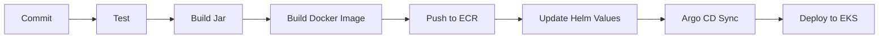

# RetireEasy Deployment Plan for EKS with Helm, Argo CD, and Istio

## Goal

Move the current Spring Boot microservices from plain Kubernetes YAML to a GitOps-based deployment model on Amazon EKS using:

- Helm for packaging and environment-specific configuration
- Argo CD for continuous delivery and cluster reconciliation
- Istio for service mesh, traffic management, and observability
- Amazon ECR for container images
- Amazon RDS for PostgreSQL

This document gives you:

- the target architecture
- the recommended repository structure
- the implementation phases
- the exact order to move forward
- the main risks and design decisions

---

## Current State

Today the repo contains:

- `user-service`
- `account-service`
- `transaction-service`
- raw Kubernetes manifests under `kubernetes/`
- simple Dockerfiles for each service
- a GitLab pipeline that builds jars only

Current gaps before production-style EKS deployment:

- no Helm charts
- no GitOps flow
- no ingress or service mesh
- no secrets strategy
- no centralized observability
- no environment separation such as `dev`, `qa`, `prod`
- no external database strategy defined

---

## Recommended Target Architecture

### High-Level View



### Logical Platform Layers



### GitOps Deployment Flow



---

## Recommended Repository Strategy

You have two good options.

### Option A: Single Repo

Keep application code, Helm charts, and Argo CD application definitions in this same repo.

Good for:

- small teams
- early-stage platform setup
- easier onboarding

Tradeoff:

- app code and deployment config are tightly coupled

### Option B: Split Repo Model

Use:

- one app repo for source code and Dockerfiles
- one GitOps repo for Helm values and Argo CD apps

Good for:

- cleaner GitOps separation
- environment promotion workflows
- platform governance

Tradeoff:

- a little more operational complexity

### Recommendation

Start with Option A if you are building alone or with a small team.
Move to Option B once deployments and promotions become frequent.

---

## Recommended Folder Structure

If you keep everything in this repo, move toward this structure:

```text
retireeasy-platform/
  account-service/
  user-service/
  transaction-service/
  helm/
    retireeasy/
      Chart.yaml
      values.yaml
      values-dev.yaml
      values-qa.yaml
      values-prod.yaml
      templates/
        user-service-deployment.yaml
        user-service-service.yaml
        account-service-deployment.yaml
        account-service-service.yaml
        transaction-service-deployment.yaml
        transaction-service-service.yaml
        destinationrules.yaml
        virtualservices.yaml
        peerauthentication.yaml
  argocd/
    projects/
    applications/
      retireeasy-dev.yaml
      retireeasy-qa.yaml
      retireeasy-prod.yaml
  kubernetes/
    legacy/
  deploy.md
```

Alternative structure if you prefer one chart per service:

```text
helm/
  user-service/
  account-service/
  transaction-service/
  platform/
```

For your size, one umbrella chart named `retireeasy` is the easiest starting point.

---

## Target Runtime Design

### 1. Networking

- Use an AWS Load Balancer in front of the Istio ingress gateway.
- Route external traffic through Istio `Gateway` and `VirtualService`.
- Keep internal service-to-service communication inside the mesh.

### 2. Service Discovery

- Kubernetes service names remain internal DNS names.
- Example:
  - `account-service.default.svc.cluster.local`

### 3. Database

- Use Amazon RDS PostgreSQL instead of a PostgreSQL pod inside EKS.
- Use one database instance with separate schemas, or separate databases per service.

Recommendation:

- short term: one RDS instance, one database, separate schemas
- longer term: one database per service if service autonomy becomes important

### 4. Secrets

- Do not hardcode DB credentials in Helm values or manifests.
- Use:
  - AWS Secrets Manager + External Secrets Operator
  - or Kubernetes secrets generated securely in CI

Recommendation:

- use AWS Secrets Manager + External Secrets Operator

### 5. Traffic and Resilience

Istio can provide:

- retries
- timeouts
- mTLS
- canary releases
- circuit breaking

For your transaction flow, this is especially useful because `transaction-service` depends on `account-service`.

### 6. Observability

Minimum stack:

- Prometheus
- Grafana
- Kiali
- Jaeger or Tempo
- CloudWatch logs or EFK

---

## Recommended EKS Namespaces

Use separate namespaces by concern.

```text
argocd
istio-system
retireeasy-dev
retireeasy-qa
retireeasy-prod
monitoring
external-secrets
```

This makes Argo CD boundaries, Istio injection, and environment separation much cleaner.

---

## Step-by-Step Execution Plan

## Phase 1: Standardize the Application Layer

Before Helm or Argo CD, make the services deployment-ready.

### Tasks

1. Standardize Spring Boot versions across all services.
2. Standardize dependency style across all services.
3. Fix the Maven wrapper.
4. Make configuration fully environment-driven.
5. Externalize all service URLs and DB properties.
6. Add readiness and liveness probes.
7. Add actuator endpoints.
8. Add resource requests and limits.
9. Add structured logging.
10. Add health checks for downstream dependencies if needed.

### Why first

If the apps are not consistent and probe-ready, Helm and Argo CD will only automate unstable deployments.

---

## Phase 2: Container Hardening

Improve the Docker images before production rollout.

### Tasks

1. Use multi-stage Docker builds.
2. Run as a non-root user.
3. Pin base image versions.
4. Expose only required ports.
5. Add JVM memory flags where appropriate.
6. Make image tags immutable.

### Example Direction

- build jar in Maven stage
- run app in slim JRE stage
- tag images as commit SHA, not `1.0`

---

## Phase 3: Introduce Helm

Convert the current raw manifests into Helm templates.

### What to template

- Deployments
- Services
- ConfigMaps if needed
- Secrets references
- ServiceAccounts
- HorizontalPodAutoscaler
- Istio resources

### Helm design recommendation

Use one umbrella chart for the whole platform.

Suggested values structure:

```yaml
global:
  namespace: retireeasy-dev
  imagePullSecrets:
    - ecr-secret
  database:
    host: your-rds-endpoint
    port: 5432
    name: retireeasy

userService:
  image:
    repository: <ecr>/user-service
    tag: "sha-123"
  replicaCount: 2

accountService:
  image:
    repository: <ecr>/account-service
    tag: "sha-123"
  replicaCount: 2

transactionService:
  image:
    repository: <ecr>/transaction-service
    tag: "sha-123"
  replicaCount: 2
  accountServiceUrl: http://account-service:8082
```

### Deliverables

1. `helm/retireeasy/Chart.yaml`
2. `helm/retireeasy/values.yaml`
3. `helm/retireeasy/values-dev.yaml`
4. `helm/retireeasy/values-qa.yaml`
5. `helm/retireeasy/values-prod.yaml`
6. templates for each service

---

## Phase 4: Provision AWS Infrastructure

Set up the foundation around EKS.

### Required AWS resources

1. VPC with public and private subnets
2. EKS cluster
3. managed node groups or Karpenter
4. ECR repositories
5. RDS PostgreSQL
6. IAM roles for service accounts
7. AWS Load Balancer Controller
8. Route 53 if you need custom domains
9. ACM certificate for TLS
10. Secrets Manager

### Recommendation

Provision these with Terraform or OpenTofu rather than manually.

### Minimum infra modules

- networking
- eks
- ecr
- rds
- iam
- secrets

---

## Phase 5: Install Cluster Add-ons

Install core operators and platform tooling into EKS.

### Install in this order

1. AWS Load Balancer Controller
2. metrics-server
3. External Secrets Operator
4. Istio base
5. Istio control plane
6. Istio ingress gateway
7. Argo CD
8. Prometheus and Grafana
9. Kiali

### Notes

- enable sidecar injection for app namespaces
- validate Istio ingress before onboarding apps
- keep Argo CD in its own namespace

---

## Phase 6: Add Istio Service Mesh

Use Istio after the services already run on EKS without it.

### Rollout approach

1. Deploy services to EKS without Istio first.
2. Confirm pods, services, probes, and DB connectivity work.
3. Enable Istio sidecar injection in `retireeasy-dev`.
4. Add `Gateway` and `VirtualService`.
5. Add `DestinationRule`.
6. Add mTLS policies.
7. Add retry and timeout policies for service-to-service calls.

### Example benefits for your app

- retries from `transaction-service` to `account-service`
- request tracing across services
- gradual canary rollout for transaction logic

### Istio traffic example



---

## Phase 7: Add Argo CD GitOps

Argo CD should become the deployment entry point after Helm charts exist.

### GitOps model

- CI builds and pushes images to ECR
- CI updates Helm values or image tag manifests in Git
- Argo CD detects the Git change
- Argo CD syncs the Helm release into EKS

### Argo CD structure recommendation

Use:

- one `AppProject` for `retireeasy`
- one `Application` per environment

Example:

- `retireeasy-dev`
- `retireeasy-qa`
- `retireeasy-prod`

### Promotion model

1. merge to main updates `dev`
2. promote tested image tag to `qa`
3. promote approved image tag to `prod`

Avoid rebuilding different images per environment.
Promote the same immutable image tag.

---

## Phase 8: Update CI/CD Pipeline

Your current GitLab CI only packages jars. Expand it into:

### Desired pipeline stages

1. test
2. package
3. build-image
4. security-scan
5. push-image
6. update-gitops-config

### Example deployment flow



### Tagging strategy

Use:

- Git commit SHA for images
- optional semantic release tag for milestone builds

Avoid:

- mutable tags like `latest`
- manual image tags like `1.0`

---

## Phase 9: Environment Rollout Order

Deploy in this order:

1. local Docker validation
2. local Helm rendering
3. `retireeasy-dev` on EKS
4. `retireeasy-qa`
5. `retireeasy-prod`

### Do not start with production

Istio, Argo CD, EKS networking, IRSA, and RDS connectivity each add moving parts.
You want to burn down integration risk in `dev` first.

---

## Phase 10: Security and Production Readiness

Before calling the platform production-ready, add:

1. TLS termination
2. mTLS inside mesh
3. network policies if appropriate
4. pod security settings
5. secret rotation
6. image scanning
7. audit logging
8. backup strategy for RDS
9. autoscaling
10. disaster recovery expectations

---

## Recommended Implementation Order for You

If you want the safest path, follow this exact order:

1. Fix service consistency.
2. Fix build and wrapper issues.
3. Improve Dockerfiles.
4. Move raw manifests into Helm.
5. Create environment values files.
6. Provision ECR, EKS, RDS, and IAM.
7. Deploy services to EKS with Helm only.
8. Verify app health, DB connectivity, and DNS.
9. Install Istio and onboard the app namespace.
10. Add ingress gateway routing.
11. Add retries, timeouts, and mTLS.
12. Install Argo CD.
13. Convert deployment flow to GitOps.
14. Add monitoring, tracing, and dashboards.
15. Add QA and prod environments.

This order matters.
Do not introduce Helm, Argo CD, Istio, and EKS all at once.

---

## Suggested Milestones

### Milestone 1: Application Readiness

Success looks like:

- all three services build consistently
- images are clean and reproducible
- probes and actuator endpoints exist

### Milestone 2: Helm Readiness

Success looks like:

- all current manifests are replaced by Helm templates
- environment overrides work
- local `helm template` output is clean

### Milestone 3: EKS Base Platform

Success looks like:

- EKS cluster is live
- RDS is reachable
- services deploy using Helm

### Milestone 4: Service Mesh

Success looks like:

- Istio sidecars injected
- ingress routing works
- internal traffic policies applied

### Milestone 5: GitOps

Success looks like:

- Argo CD owns the environment
- sync status reflects desired state
- image promotions happen through Git changes

---

## Main Design Decisions You Need to Make

These decisions should be made early.

### Decision 1: One chart or three charts

Recommendation:

- start with one umbrella chart

### Decision 2: Same repo or separate GitOps repo

Recommendation:

- start in same repo unless you already have a platform repo pattern

### Decision 3: One DB or DB per service

Recommendation:

- one RDS instance with separate schemas first

### Decision 4: Secret management

Recommendation:

- AWS Secrets Manager + External Secrets Operator

### Decision 5: Ingress style

Recommendation:

- AWS Load Balancer to Istio ingress gateway

---

## Risks and Common Mistakes

### Mistake 1

Trying to introduce Helm, Argo CD, Istio, and EKS at the same time.

### Mistake 2

Using mutable image tags and losing traceability.

### Mistake 3

Hardcoding DB credentials or service URLs into manifests.

### Mistake 4

Skipping health probes and then debugging unstable rollouts.

### Mistake 5

Putting PostgreSQL inside the cluster for a production-like environment.

### Mistake 6

Using Argo CD before the Helm charts are stable.

### Mistake 7

Enabling Istio before the application already works on plain EKS.

---

## What You Should Build First in This Repo

Your next repo changes should be:

1. create a `helm/retireeasy` chart
2. move service deployment config into `values.yaml`
3. add `values-dev.yaml`, `values-qa.yaml`, and `values-prod.yaml`
4. update GitLab CI to build Docker images and push to ECR
5. add `argocd/applications/retireeasy-dev.yaml`
6. keep current `kubernetes/` manifests as legacy until Helm is validated

---

## First Practical Sprint Plan

If I were implementing this with you, I would do Sprint 1 like this:

### Sprint 1

1. fix Maven wrapper and version alignment
2. add actuator and probes
3. improve Dockerfiles
4. create Helm umbrella chart
5. template all three services
6. render and validate Helm locally

### Sprint 2

1. provision ECR, EKS, and RDS
2. deploy with Helm to `retireeasy-dev`
3. validate connectivity and rollout behavior

### Sprint 3

1. install Istio
2. add ingress gateway, virtual services, and policies
3. validate mesh behavior and tracing

### Sprint 4

1. install Argo CD
2. create environment applications
3. convert CI to image-build plus GitOps-update flow

---

## Definition of Done

You are in a strong state when:

- developers push code
- CI builds and pushes immutable images to ECR
- Git stores the desired Helm values
- Argo CD syncs the desired state into EKS
- Istio manages ingress and internal traffic behavior
- RDS stores persistent data
- secrets come from a secure external store
- monitoring and tracing show service health

---

## Final Recommendation

Move in layers:

1. app readiness
2. Helm packaging
3. AWS infrastructure
4. EKS deployment
5. Istio mesh
6. Argo CD GitOps
7. observability and hardening

That sequence will keep the project understandable and reduce failure points.

---

## Suggested Next Action

The best next step is to convert the existing `kubernetes/` manifests into a Helm umbrella chart and standardize the service configuration model before touching EKS or Argo CD.

Once you want, I can do the next implementation step and generate:

- the `helm/retireeasy` chart
- starter Argo CD application manifests
- Istio gateway and virtual service templates
- updated GitLab CI for ECR image builds
